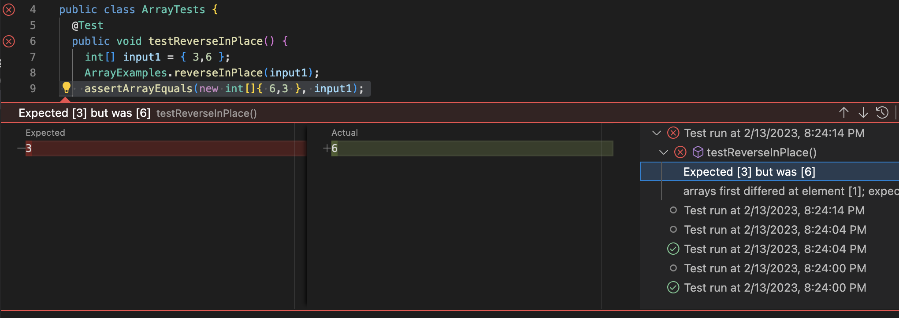
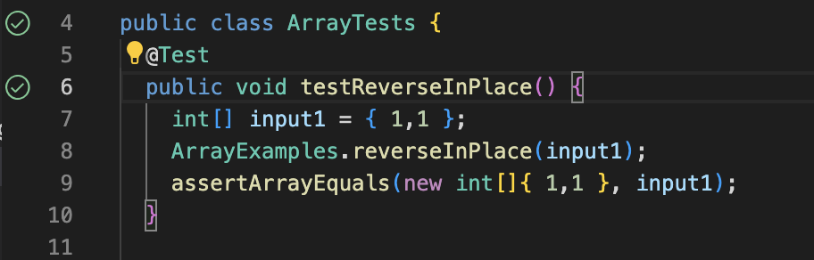

This report consists of three total parts. 

* **Part 2: Bugs** </br>
A failure inducing input: 
```
  @ Test
  public void test ReverseInPlace(){
      int[] input1 = {3,6};
      ArrayExamples.reverseInPlace(input1);
      assertArrayEquals(new int[] {6,3}, input1);
  }
```

An input that does not induce failure: 
```
  @ Test
  public void test ReverseInPlace(){
      int[] input1 = {1,1};
      ArrayExamples.reverseInPlace(input1);
      assertArrayEquals(new int[] {1,1}, input1);
  }
```

Symptom: 

 </br>

It fails because after the array is reversed, the output is incorrect. 

 </br>

It passes the test since the when the array is reversed, the output is the same.

Code with bug (pre-fix):
```
static void reverseInPlace(int[] arr) {
    for(int i = 0; i < arr.length; i += 1) {
      arr[i] = arr[arr.length - i - 1];
    }
}
```

Code without bug (post-fix):
```
static void reverseInPlace(int[] arr){
    for (int i = 0; i < arr.length/2; i+= 1){
        int temp = arr[i];
        arr[i] = arr[arr.length - i - 1];
        arr[arr.length - i - 1] = temp;
    }
}
```

The bug was that the code only copies the back elements forward, but not the front elements backwards. I fixed the code by adding two lines that stores the initial front element, and copying them over to the back.

* **Part 3: Reflection** </br>

In week 2, we learned about how hosting works and also got a sneak preview of how URLs actually work. All these time I have been wodnering what does url actually represent when we visit websites since URLs seem to change with every click within the website. Now I learn they are actually paths and it interests me to learn more about it on my own.
