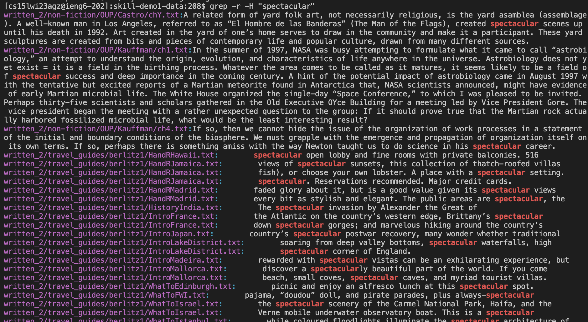
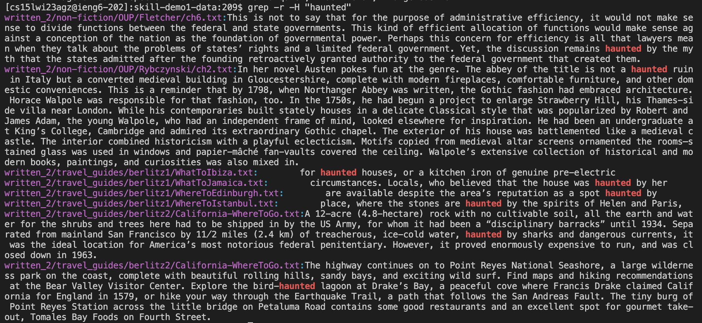

This report is a writeup about researching commands. 

**Command 1: Recursive , -r** 
<br>
This command searches not only in the folder, but recursively within files in that folder. 

Example: "WhereToGo"
```
[cs15lwi23agz@ieng6-201]:skill-demo1-data:217$ grep -r "WhatToDo"
Binary file .git/index matches
find-results.txt:written_2/travel_guides/berlitz2/Algarve-WhatToDo.txt
find-results.txt:written_2/travel_guides/berlitz2/Amsterdam-WhatToDo.txt
find-results.txt:written_2/travel_guides/berlitz2/Athens-WhatToDo.txt
find-results.txt:written_2/travel_guides/berlitz2/Bahamas-WhatToDo.txt
find-results.txt:written_2/travel_guides/berlitz2/Bali-WhatToDo.txt
find-results.txt:written_2/travel_guides/berlitz2/Barcelona-WhatToDo.txt
find-results.txt:written_2/travel_guides/berlitz2/Beijing-WhatToDo.txt
find-results.txt:written_2/travel_guides/berlitz2/Berlin-WhatToDo.txt
find-results.txt:written_2/travel_guides/berlitz2/Bermuda-WhatToDo.txt
find-results.txt:written_2/travel_guides/berlitz2/Budapest-WhatToDo.txt
find-results.txt:written_2/travel_guides/berlitz2/California-WhatToDo.txt
find-results.txt:written_2/travel_guides/berlitz2/CanaryIslands-WhatToDo.txt
find-results.txt:written_2/travel_guides/berlitz2/Cancun-WhatToDo.txt
find-results.txt:written_2/travel_guides/berlitz2/China-WhatToDo.txt
find-results.txt:written_2/travel_guides/berlitz2/Costa-WhatToDo.txt
find-results.txt:written_2/travel_guides/berlitz2/CostaBlanca-WhatToDo.txt
find-results.txt:written_2/travel_guides/berlitz2/Crete-WhatToDo.txt
find-results.txt:written_2/travel_guides/berlitz2/Cuba-WhatToDo.txt
find-results.txt:written_2/travel_guides/berlitz2/Nepal-WhatToDo.txt
find-results.txt:written_2/travel_guides/berlitz2/Paris-WhatToDo.txt
find-results.txt:written_2/travel_guides/berlitz2/Poland-WhatToDo.txt
find-results.txt:written_2/travel_guides/berlitz2/Portugal-WhatToDo.txt
find-results.txt:written_2/travel_guides/berlitz2/PuertoRico-WhatToDo.txt
find-results.txt:written_2/travel_guides/berlitz2/Vallarta-WhatToDo.txt
grep-results.txt:written_2/travel_guides/berlitz2/Algarve-WhatToDo.txt
grep-results.txt:written_2/travel_guides/berlitz2/Amsterdam-WhatToDo.txt
grep-results.txt:written_2/travel_guides/berlitz2/Athens-WhatToDo.txt
grep-results.txt:written_2/travel_guides/berlitz2/Bahamas-WhatToDo.txt
grep-results.txt:written_2/travel_guides/berlitz2/Bali-WhatToDo.txt
grep-results.txt:written_2/travel_guides/berlitz2/Barcelona-WhatToDo.txt
grep-results.txt:written_2/travel_guides/berlitz2/Beijing-WhatToDo.txt
grep-results.txt:written_2/travel_guides/berlitz2/Berlin-WhatToDo.txt
grep-results.txt:written_2/travel_guides/berlitz2/Bermuda-WhatToDo.txt
grep-results.txt:written_2/travel_guides/berlitz2/Budapest-WhatToDo.txt
grep-results.txt:written_2/travel_guides/berlitz2/California-WhatToDo.txt
grep-results.txt:written_2/travel_guides/berlitz2/CanaryIslands-WhatToDo.txt
grep-results.txt:written_2/travel_guides/berlitz2/Cancun-WhatToDo.txt
grep-results.txt:written_2/travel_guides/berlitz2/China-WhatToDo.txt
grep-results.txt:written_2/travel_guides/berlitz2/Costa-WhatToDo.txt
grep-results.txt:written_2/travel_guides/berlitz2/CostaBlanca-WhatToDo.txt
grep-results.txt:written_2/travel_guides/berlitz2/Crete-WhatToDo.txt
grep-results.txt:written_2/travel_guides/berlitz2/Cuba-WhatToDo.txt
grep-results.txt:written_2/travel_guides/berlitz2/Nepal-WhatToDo.txt
grep-results.txt:written_2/travel_guides/berlitz2/Paris-WhatToDo.txt
grep-results.txt:written_2/travel_guides/berlitz2/Poland-WhatToDo.txt
grep-results.txt:written_2/travel_guides/berlitz2/Portugal-WhatToDo.txt
grep-results.txt:written_2/travel_guides/berlitz2/PuertoRico-WhatToDo.txt
grep-results.txt:written_2/travel_guides/berlitz2/Vallarta-WhatToDo.txt
grep-result.txt:written_2/travel_guides/berlitz2/Algarve-WhatToDo.txt
grep-result.txt:written_2/travel_guides/berlitz2/Amsterdam-WhatToDo.txt
grep-result.txt:written_2/travel_guides/berlitz2/Athens-WhatToDo.txt
grep-result.txt:written_2/travel_guides/berlitz2/Bahamas-WhatToDo.txt
grep-result.txt:written_2/travel_guides/berlitz2/Bali-WhatToDo.txt
grep-result.txt:written_2/travel_guides/berlitz2/Barcelona-WhatToDo.txt
grep-result.txt:written_2/travel_guides/berlitz2/Beijing-WhatToDo.txt
grep-result.txt:written_2/travel_guides/berlitz2/Berlin-WhatToDo.txt
grep-result.txt:written_2/travel_guides/berlitz2/Bermuda-WhatToDo.txt
grep-result.txt:written_2/travel_guides/berlitz2/Budapest-WhatToDo.txt
grep-result.txt:written_2/travel_guides/berlitz2/California-WhatToDo.txt
grep-result.txt:written_2/travel_guides/berlitz2/CanaryIslands-WhatToDo.txt
grep-result.txt:written_2/travel_guides/berlitz2/Cancun-WhatToDo.txt
grep-result.txt:written_2/travel_guides/berlitz2/China-WhatToDo.txt
grep-result.txt:written_2/travel_guides/berlitz2/Costa-WhatToDo.txt
grep-result.txt:written_2/travel_guides/berlitz2/CostaBlanca-WhatToDo.txt
grep-result.txt:written_2/travel_guides/berlitz2/Crete-WhatToDo.txt
grep-result.txt:written_2/travel_guides/berlitz2/Cuba-WhatToDo.txt
grep-result.txt:written_2/travel_guides/berlitz2/Nepal-WhatToDo.txt
grep-result.txt:written_2/travel_guides/berlitz2/Paris-WhatToDo.txt
grep-result.txt:written_2/travel_guides/berlitz2/Poland-WhatToDo.txt
grep-result.txt:written_2/travel_guides/berlitz2/Portugal-WhatToDo.txt
grep-result.txt:written_2/travel_guides/berlitz2/PuertoRico-WhatToDo.txt
grep-result.txt:written_2/travel_guides/berlitz2/Vallarta-WhatToDo.txt
find_results.txt:written_2/travel_guides/berlitz2/Algarve-WhatToDo.txt
find_results.txt:written_2/travel_guides/berlitz2/Amsterdam-WhatToDo.txt
find_results.txt:written_2/travel_guides/berlitz2/Athens-WhatToDo.txt
find_results.txt:written_2/travel_guides/berlitz2/Bahamas-WhatToDo.txt
find_results.txt:written_2/travel_guides/berlitz2/Bali-WhatToDo.txt
find_results.txt:written_2/travel_guides/berlitz2/Barcelona-WhatToDo.txt
find_results.txt:written_2/travel_guides/berlitz2/Beijing-WhatToDo.txt
find_results.txt:written_2/travel_guides/berlitz2/Berlin-WhatToDo.txt
find_results.txt:written_2/travel_guides/berlitz2/Bermuda-WhatToDo.txt
find_results.txt:written_2/travel_guides/berlitz2/Budapest-WhatToDo.txt
find_results.txt:written_2/travel_guides/berlitz2/California-WhatToDo.txt
find_results.txt:written_2/travel_guides/berlitz2/CanaryIslands-WhatToDo.txt
find_results.txt:written_2/travel_guides/berlitz2/Cancun-WhatToDo.txt
find_results.txt:written_2/travel_guides/berlitz2/China-WhatToDo.txt
find_results.txt:written_2/travel_guides/berlitz2/Costa-WhatToDo.txt
find_results.txt:written_2/travel_guides/berlitz2/CostaBlanca-WhatToDo.txt
find_results.txt:written_2/travel_guides/berlitz2/Crete-WhatToDo.txt
find_results.txt:written_2/travel_guides/berlitz2/Cuba-WhatToDo.txt
find_results.txt:written_2/travel_guides/berlitz2/Nepal-WhatToDo.txt
find_results.txt:written_2/travel_guides/berlitz2/Paris-WhatToDo.txt
find_results.txt:written_2/travel_guides/berlitz2/Poland-WhatToDo.txt
find_results.txt:written_2/travel_guides/berlitz2/Portugal-WhatToDo.txt
find_results.txt:written_2/travel_guides/berlitz2/PuertoRico-WhatToDo.txt
find_results.txt:written_2/travel_guides/berlitz2/Vallarta-WhatToDo.txt
grep_results.txt:written_2/travel_guides/berlitz2/Algarve-WhatToDo.txt
grep_results.txt:written_2/travel_guides/berlitz2/Amsterdam-WhatToDo.txt
grep_results.txt:written_2/travel_guides/berlitz2/Athens-WhatToDo.txt
grep_results.txt:written_2/travel_guides/berlitz2/Bahamas-WhatToDo.txt
grep_results.txt:written_2/travel_guides/berlitz2/Bali-WhatToDo.txt
grep_results.txt:written_2/travel_guides/berlitz2/Barcelona-WhatToDo.txt
grep_results.txt:written_2/travel_guides/berlitz2/Beijing-WhatToDo.txt
grep_results.txt:written_2/travel_guides/berlitz2/Berlin-WhatToDo.txt
grep_results.txt:written_2/travel_guides/berlitz2/Bermuda-WhatToDo.txt
grep_results.txt:written_2/travel_guides/berlitz2/Budapest-WhatToDo.txt
grep_results.txt:written_2/travel_guides/berlitz2/California-WhatToDo.txt
grep_results.txt:written_2/travel_guides/berlitz2/CanaryIslands-WhatToDo.txt
grep_results.txt:written_2/travel_guides/berlitz2/Cancun-WhatToDo.txt
grep_results.txt:written_2/travel_guides/berlitz2/China-WhatToDo.txt
grep_results.txt:written_2/travel_guides/berlitz2/Costa-WhatToDo.txt
grep_results.txt:written_2/travel_guides/berlitz2/CostaBlanca-WhatToDo.txt
grep_results.txt:written_2/travel_guides/berlitz2/Crete-WhatToDo.txt
grep_results.txt:written_2/travel_guides/berlitz2/Cuba-WhatToDo.txt
grep_results.txt:written_2/travel_guides/berlitz2/Nepal-WhatToDo.txt
grep_results.txt:written_2/travel_guides/berlitz2/Paris-WhatToDo.txt
grep_results.txt:written_2/travel_guides/berlitz2/Poland-WhatToDo.txt
grep_results.txt:written_2/travel_guides/berlitz2/Portugal-WhatToDo.txt
grep_results.txt:written_2/travel_guides/berlitz2/PuertoRico-WhatToDo.txt
grep_results.txt:written_2/travel_guides/berlitz2/Vallarta-WhatToDo.txt
```

This example shows that the string "WhereToGo" had been found in files that are further down the path directory, and not limited to the current workspace.

Example: "WhatToDo"


This example shows that the string "WhatToDo" had been found in files that are further down the path directory, and not limited to the current workspace.

**Command 2: Count , -c** 

This command counts the number of time the given argument appears within the file.

Example: "the"


The value on the right of the file name indicates the number of times that the string, "the", appears in the file. 

Example: "travel"


The value on the right of the file name indicates the number of times that the string, "travel", appears in the file. 

**Command 3: Only Matching , -o** 

This command searches and prints only the matching texts, and nothing more.

Example: "Singapore"


The output, "Singapore" is printed only when the file consists of it. It also does not print out any other unnecessary texts, other than the particular keyword(s) we are searching for.

Example: "Xian"


The output, "Xian" is printed only when the file consists of it. It also does not print out any other unnecessary texts, other than the particular keyword(s) we are searching for.

**Command 3: Line Print , -H** 

This command searches and prints only the lines in which the keyword is found.

Example: "spectacular"


We can see that the lines in which the keyword we are searching for, "spectacular", is printed. This can be beneficial if we want some context as to where the keyword is found.

Example: "haunted"


We can see that the lines in which the keyword we are searching for, "haunted", is printed. This can be beneficial if we want some context as to where the keyword is found.
