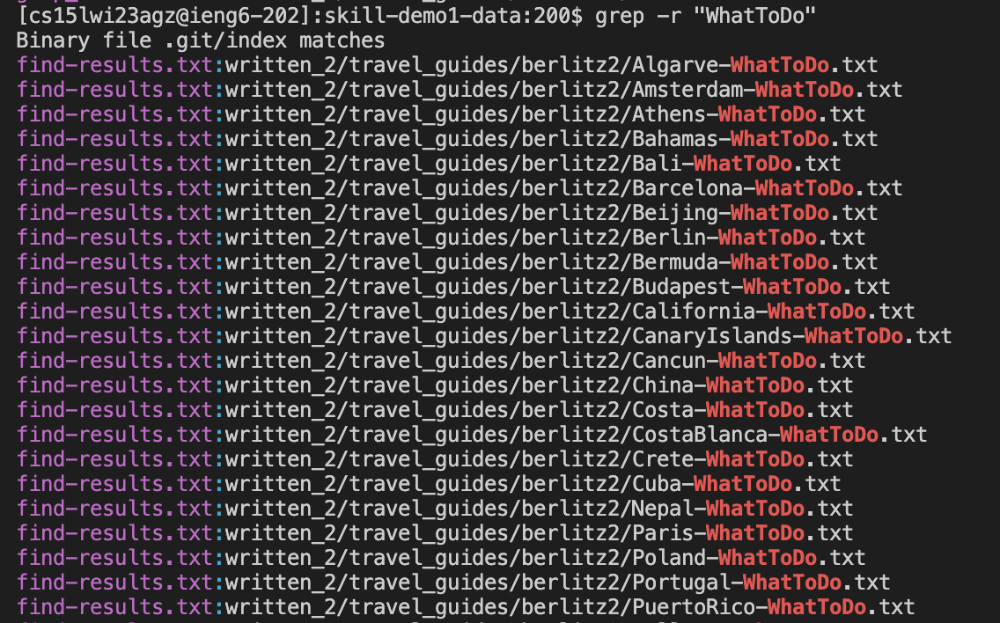
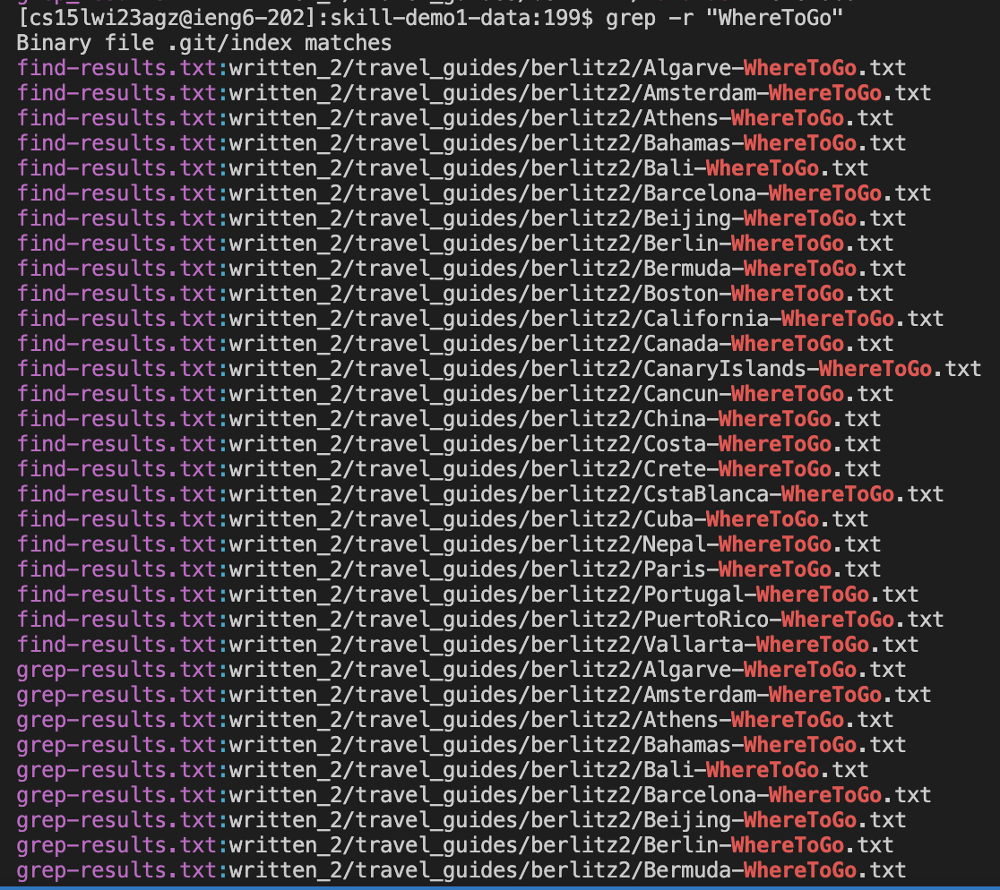
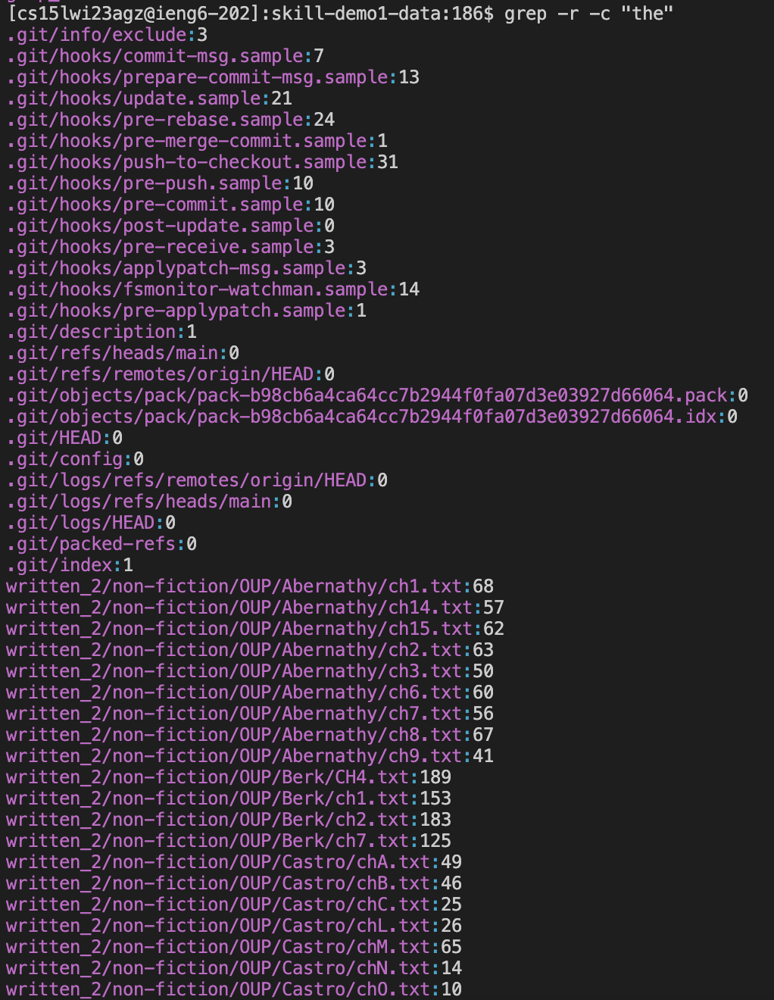
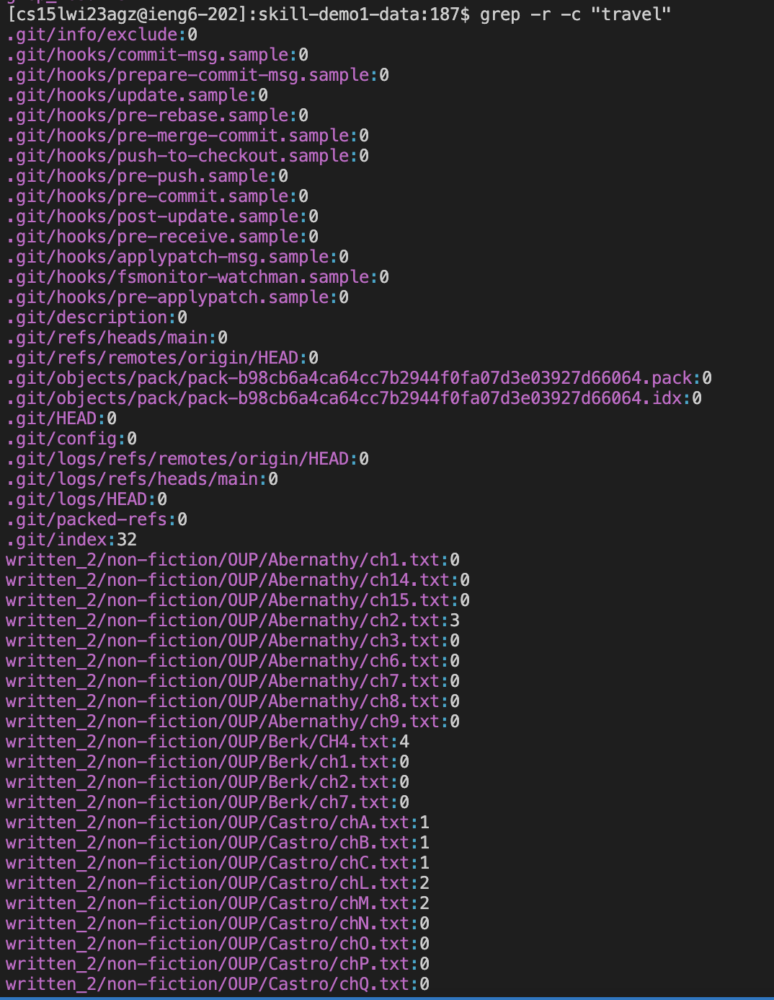
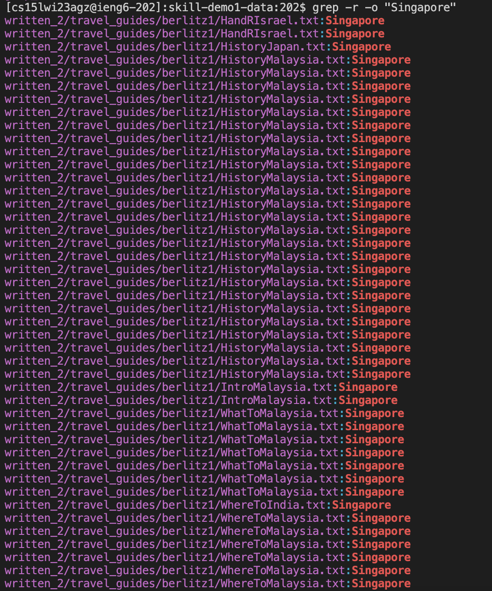
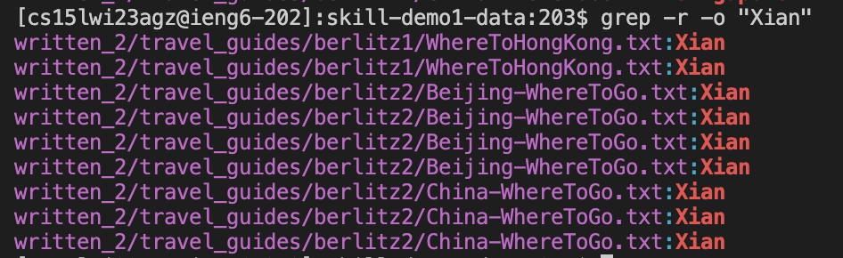

This report is a writeup about researching commands. 

**Command 1: Recursive , -r** 

This command searches not only in the folder, but recursively within files in that folder. 

Example: "WhereToGo"

This example shows that the string "WhereToGo" had been found in files that are further down the path directory, and not limited to the current workspace.

Example: "WhatToDo"

This example shows that the string "WhatToDo" had been found in files that are further down the path directory, and not limited to the current workspace.

**Command 2: Count , -c** 

This command counts the number of time the given argument appears within the file.

Example: "the"

The value on the right of the file name indicates the number of times that the string, "the", appears in the file. 

Example: "travel"

The value on the right of the file name indicates the number of times that the string, "travel", appears in the file. 

**Command 3: Only Matching , -o** 

This command searches and prints only the matching texts, and nothing more.

Example: "Singapore"

The output, "Singapore" is printed only when the file consists of it. It also does not print out any other unnecessary texts, other than the particular keyword(s) we are searching for.

Example: "Xian"

The output, "Xian" is printed only when the file consists of it. It also does not print out any other unnecessary texts, other than the particular keyword(s) we are searching for.
