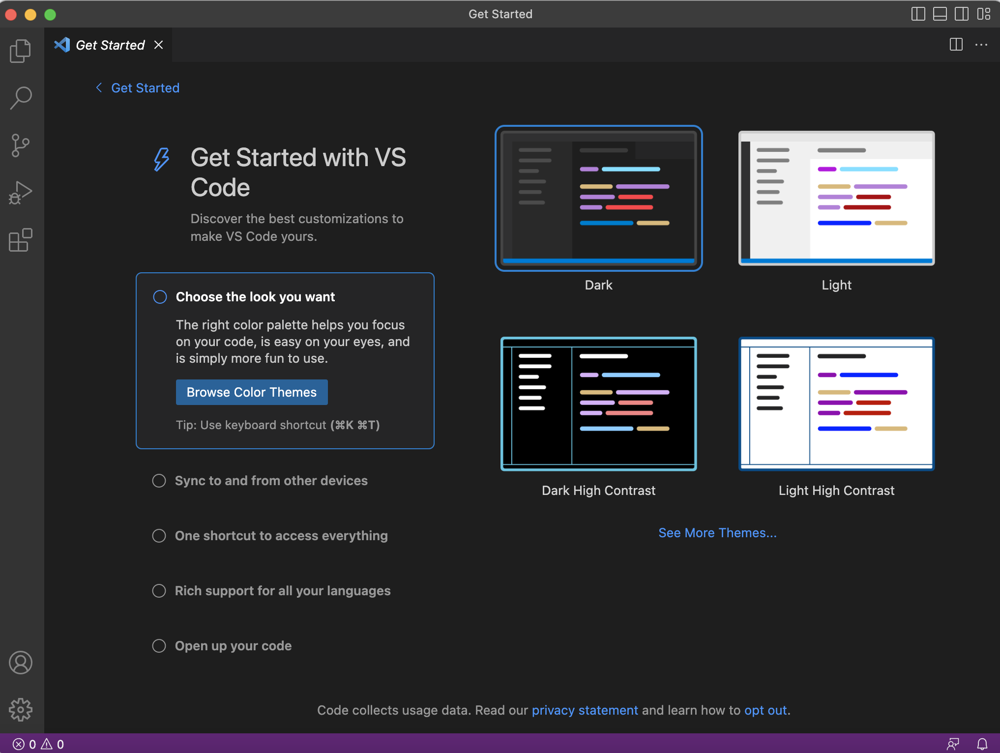

This tutorial guides you on logging into a course specific account on `ieng6`. 
* **Installing VSCode**
It is easy to download VScode on your computer. Simply head to https://code.visualstudio.com/ and hit download. Then, unpack the downloaded package and you're done! You should see something like this: 

*what your downloaded VScode should look like after you open it*
* **Remote connecting**
If you are using Windows, you need to install git. You can download git, for Windows [here](https://gitforwindows.org/).

If you are using a Mac, git is already pre-installed for you so there is no need for any downloads. 

Then, to use `ssh`, open a terminal in VScode. Type in the following command, replacing `zz` with the letters in your course-specific account:
`ssh cs15lwi23zz@ieng6.ucsd.edu`. 

You should expect an error-like message, as per below. 

```
⤇ ssh cs15lwi23zz@ieng6.ucsd.edu
The authenticity of host 'ieng6.ucsd.edu (128.54.70.227)' can't be established.
RSA key fingerprint is SHA256:ksruYwhnYH+sySHnHAtLUHngrPEyZTDl/1x99wUQcec.
Are you sure you want to continue connecting (yes/no/[fingerprint])? 
```

This is normal since it is your first time connecting. Just enter `yes` and you will be good to go. 

* **Trying some commands**
